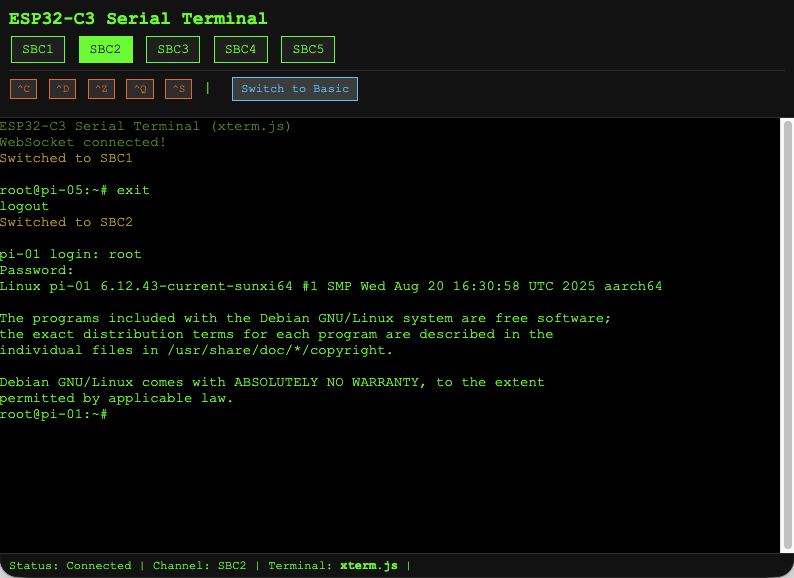

# ESP32-C3 Serial Multiplexer

web-based serial terminal multiplexer

Turn One ESP32 Into 16 Serial Consoles - Access All Your SBCs From Any Browser!

$10 DIY Alternative to $500 Serial Console Servers
Open-source ESP32-C3 serial multiplexer with real-time WebSocket terminal - Control 16 devices from one browser tab
Manage Raspberry Pi clusters, server farms, and embedded systems remotely without expensive KVM switches

uses: ESP32-C3 with 0.43 screen and analog multiplexer CD74HC4067 probably works wirh 74HC4051

Key Features: Browser-based terminal | Real-time WebSocket connection | 115200+ baud support | Analog MUX for hardware switching | No software overhead | Open-source hardware & firmware



## 🚀 **Quick Setup**

1. **Clone the repository**
2. **Configure WiFi credentials:**
   ```bash
   cp include/credentials_sample.h include/credentials.h
   # Edit include/credentials.h with your WiFi SSID and password
   ```
3. **Build and upload:**
   ```bash
   pio run --target upload
   ```
   *(Filesystem uploads automatically!)*
4. **Access the web interface** at the IP address shown on the OLED display

## 🎯 **Features**

- **Real-time WebSocket Terminal**: Character-by-character bi-directional communication
- **16-Channel Serial Multiplexer**: Dual HP4067-based channel switching (0-15)
- **OLED Status Display**: Shows IP address and connection status
- **Status LED Indicator**: Visual WebSocket connection feedback
- **Web Interface**: Green/black terminal styling with favicon
- **LittleFS with Gzip Compression**: Optimized web asset delivery
- **Minimal Dependencies**: Only 3 required libraries

## 🔧 **Hardware Requirements**

### **ABROBOT ESP32-C3 Development Board**
- **MCU**: ESP32-C3 with native USB CDC support
- **OLED**: 0.42" SSD1306 display (72×40 effective resolution)
- **I2C**: GPIO5 (SDA), GPIO6 (SCL), Address 0x3C
- **Status LED**: GPIO8 (onboard LED)

### **Dual HP4067 16-Channel Analog Multiplexers**
- **Quantity**: 2 HP4067 boards required (one for TX, one for RX)
- **Control Pins**: 4-bit binary selection (S0-S3) connected together on both boards
- **Channels**: 16 channels (0-15), using 0-4 for SBC1-SBC5
- **Signal Routing**: Separate TX and RX UART communication paths

## 📋 **Pin Configuration**

### **ESP32-C3 to Dual HP4067 Wiring**

**Control Pins (Connected to Both HP4067 Boards)**:
```
ESP32-C3    HP4067-TX   HP4067-RX   Function
GPIO3   →   S0      →   S0          LSB - Channel select bit 0
GPIO4   →   S1      →   S1          Channel select bit 1
GPIO9   →   S2      →   S2          Channel select bit 2
GPIO10  →   S3      →   S3          MSB - Channel select bit 3
3.3V    →   VCC     →   VCC         Power (both boards)
GND     →   GND     →   GND         Ground (both boards)
```

**Signal Pins (Separate TX/RX Paths)**:
```
ESP32-C3    HP4067-TX   HP4067-RX   Function
GPIO0   →   SIG         -           Serial TX (to selected SBC)
GPIO1   →   -           SIG         Serial RX (from selected SBC)
```

### **OLED Display Wiring**
```
ESP32-C3    OLED        Function
GPIO5   →   SDA         I2C Data
GPIO6   →   SCL         I2C Clock
3.3V    →   VCC         Power
GND     →   GND         Ground
```

### **SBC Connections to Dual HP4067 Setup**

**Each SBC Requires 2 Connections (TX and RX)**:
```
Channel  SBC   HP4067-TX Pin  HP4067-RX Pin  SBC Connection
0        SBC1  Y0             Y0             TX → Y0-TX, RX → Y0-RX
1        SBC2  Y1             Y1             TX → Y1-TX, RX → Y1-RX
2        SBC3  Y2             Y2             TX → Y2-TX, RX → Y2-RX
3        SBC4  Y3             Y3             TX → Y3-TX, RX → Y3-RX
4        SBC5  Y4             Y4             TX → Y4-TX, RX → Y4-RX
5-15     Available Y5-Y15      Y5-Y15         Additional SBC expansion
```

**SBC Wiring Example (SBC1)**:
```
SBC1-TX  →  HP4067-RX Y0  (SBC transmits to ESP32 RX)
SBC1-RX  →  HP4067-TX Y0  (SBC receives from ESP32 TX)
```

## ⚙️ **Software Configuration**

### **1. WiFi Credentials Setup**
Edit [`include/credentials.h`](include/credentials.h):
```cpp
#ifndef CREDENTIALS_H
#define CREDENTIALS_H

const char* WIFI_SSID = "your_wifi_network";
const char* WIFI_PASSWORD = "your_wifi_password";

#endif
```

### **2. OLED Display Configuration**

the screen of this board seems to have multiple version it seems for my version turning to  U8g2 solves it and avoid previous offset/buffer tweak in toher libraries...
OUTDATED for other display libs/ ABROBOT ESP32-C3 specific settings in [`include/oled_manager.h`](include/oled_manager.h):
```cpp
#define DISPLAY_OFFSET_X 30    // ABROBOT specification
#define DISPLAY_OFFSET_Y 12    // ABROBOT specification
#define VISIBLE_WIDTH 72       // Effective resolution
#define VISIBLE_HEIGHT 40      // Effective resolution
```

### **3. Dependencies**
PlatformIO libraries in [`platformio.ini`](platformio.ini):
```ini
lib_deps =
    olikraus/U8g2@^2.34.22
    links2004/WebSockets@^2.4.0
```

### **4. LittleFS Web Assets**
The project uses LittleFS with gzip compression for web assets:
- **Source files**: [`data-src/`](data-src/) (editable HTML/CSS/JS/SVG)
- **Compressed files**: [`data/`](data/) (auto-generated .gz files)
- **Build script**: [`scripts/compress_data.py`](scripts/compress_data.py)

**Build commands**:
```bash
pio run --target upload      # Upload firmware + web assets (automatic)
pio run --target uploadfs    # Upload web assets only (manual)
```

See [`docs/littlefs-build-guide.md`](docs/littlefs-build-guide.md) for detailed build instructions.

## 🚀 **Usage Instructions**

### **1. Setup**
1. **Configure WiFi**: Edit `include/credentials.h` with your network credentials
2. **Upload Everything**: `pio run --target upload` (uploads firmware + web assets automatically)
3. **Connect Hardware**: Wire HP4067 multiplexer and OLED display as shown above
4. **Connect SBCs**: Connect your SBC devices to HP4067 channels Y0-Y4

### **2. Operation**
1. **Power On**: ESP32-C3 boots and connects to WiFi
2. **OLED Display**: Shows last 3 digits of IP address and connection status
3. **Status LED**: 
   - **OFF** = No WebSocket connection
   - **BLINKING** = WebSocket connected
4. **Web Access**: Open browser to `http://[ESP32_IP_ADDRESS]`

### **3. Web Terminal Interface**
- **Real-time Typing**: Type directly - characters sent immediately
- **Channel Selection**: Click SBC1-SBC5 buttons to switch channels
- **Terminal Controls**: 
  - **Enter**: Send newline
  - **Backspace**: Delete character
  - **Tab**: Send tab character
- **Visual Feedback**: Green/black terminal with connection status

## 📊 **Status Indicators**

### **OLED Display**
```
 123    ← IP last 3 digits (device identification)
  1     ← SBC channel number (1-5) or X if disconnected
```

### **Status LED (GPIO8)**
- **Solid OFF**: No WebSocket clients connected
- **Blinking (500ms)**: WebSocket client(s) connected

### **Web Interface**
- **Status Bar**: Shows connection status and current channel
- **Real-time Updates**: Immediate feedback for all operations

## 🔧 **Troubleshooting**

### **WebSocket UTF-8 Errors (Fixed)**
If you previously encountered "Could not decode a text frame as UTF-8" errors:
- ✅ **Fixed in current version** - No action needed
- 🔧 **If still occurring**: Clear browser cache and reconnect
- 🐛 **For debugging**: Enable debug logging with `localStorage.setItem('terminal_debug_level', '3')`

### **Debug Features**
- **Frame Testing**: Run `testWebSocketFrames()` in browser console
- **Connection Quality**: Monitor ping times and connection stability
- **Binary Frame Support**: Automatic handling of SBC boot sequences

### **Performance**
- **Optimized Buffering**: Reduced WebSocket frame overhead
- **Smart Frame Types**: Automatic text/binary frame selection
- **Error Recovery**: Graceful handling of invalid UTF-8 sequences

### **Common Issues**
1. **No WiFi Connection**: Check credentials in `include/credentials.h`
2. **OLED Not Working**: Verify I2C wiring (GPIO5/6) and address 0x3C
3. **WebSocket Connection Fails**: Check browser console for errors
4. **SBC Not Responding**: Verify multiplexer wiring and channel selection

### **Debug Commands**
```javascript
// In browser console:
localStorage.setItem('terminal_debug_level', '3');  // Enable debug logging
testWebSocketFrames();                              // Test frame handling

16-port USB serial console server
web-based serial terminal multiplexer
ESP32 UART switch matrix
browser KVM serial console
DIY server management controller
Raspberry Pi cluster management
Homelab server administration
Network device console access (routers, switches, firewalls)
Embedded systems debugging
Remote SBC fleet management
```

For detailed technical information about the UTF-8 fix, see [`docs/websocket-utf8-fix.md`](docs/websocket-utf8-fix.md).
